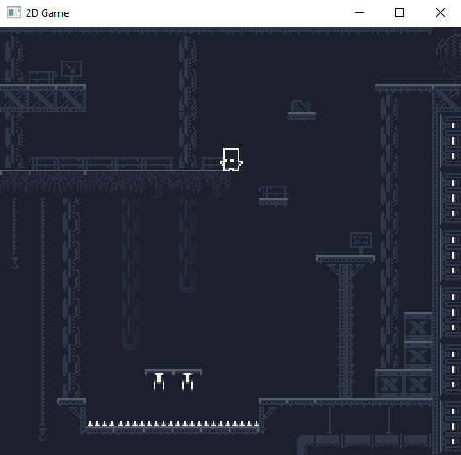

# T2DEngine
A 2d tile based game engine, with a sample platformer game constructed using the engine. Still in development.
# Motivation
The main reason behind the construction of the engine, was to have a first hand learning experience on how to contruct a component based 2d game engine. Its still in its early stages but, it already have some core feattures, as memory management, that can already be used on a game project, as can be shown by the sample game. 
# Sample game screenshots

# Tech/Framework used
  - [OpenGL/GLFW](http://www.glfw.org/) and [GLEW](http://glew.sourceforge.net/) for rendering. 
  - [stb_image](https://github.com/nothings/stb) for image loading. 
  - [CMake](https://cmake.org/) for generating the build files.
  - [Tiled](https://www.mapeditor.org/) for creating the maps used by the engine, i.e, the tmx files.
  - [TexturePacker](https://www.codeandweb.com/texturepacker) for generating the sprite atlases and the corresponding xml files used by the engine.
# Feattures
The T2DEngine is comprised of a group of modules, each one implementing a core functionality of the engine, those modules are:
  - Math, which implements all the 2d vector and matrix math used by the engine and game.
  - Mem provides a function to allocate aligned memory blocks, defines a pool data structure to manage memory blocks of the same size and, a generic memory allocator.
  - Utility defines types and data structures in unrelated domains used by the engine. As of now, it defines a timer class and a implementation of the crc32 algorithm coupled with a string_id type.
  - Io implements all the input handling
  - Rms defines a interface to create resources and resource managers.
  - Tmap defines all the data structures to load and manage the tile map's data from a .tmx file.
  - Gfx defines a interface to render sprites and tiles using a batching approach, data structures for textures and shader programs and, the engine's animation system.
  - Phy_2d defines a simple 2d world that updates all its body_2d objects according to its position and velocity, it also implements a collision system for detecting intersections between a pair of AABBs or, a AABB with a map's tile.
  - Gom implements the engine's game object hierarchy and data structures to manage the game objects.

Although most modules are incomplete, there are feattures and classes that can already be used on a game project, either in its current form or, with some custom modifications, some of them are:
  - The [pool data structure](https://github.com/mateusgondim/T2DEngine/blob/master/engine/source/mem/source/src/Pool_allocator.hpp), which manage a collection of memory blocks of the same size. 
  - The Animation system, which already have a nice implementation of a [animation state machine](https://github.com/mateusgondim/T2DEngine/blob/master/engine/source/gfx/source/src/Animator_controller.hpp), with the option to add different conditions to each transition, where each condition can operate on booleans, ints and floats parameters.
  - The implementation of a [string_id type](https://github.com/mateusgondim/T2DEngine/blob/master/engine/source/utility/source/src/string_id.hpp), using the crc-32 algorithm to generate a 32-bit unsigned value from a string.
  # Code Example
  - Pool data structure usage
  ```c++
  //creates a memory pool of 4 elements, each with a size of 5 bytes and with a 4-byte aligment requirement 
  Pool_allocator pool(4, 5, 4); 
  
  void *chunk_01, *chunk_02;
  
  chunk_01 = pool.get_element();
  chunk_02 = pool.get_element();
  
  std::cout << pool << std::endl;
  pool.free_element(chunk_02);  
  
  ```
  - Constructing a Animator controller's state machine
  ```c++
  gfx::Animator_controller *pcontroller(new gfx::Animator_controller());
  
  //creating Animations
  gfx::Animation_player player_idle_anim( gfx::Animation({5}, 5));
  gfx::Animation_player player_running_anim(gfx::Animation({8, 10, 9}, 10));
  
  //adding parameters to the state machine
  pcontroller->add_parameter("is_running", gfx::Animator_controller_parameter::Type::BOOL);
  pcontroller->add_parameter("is_jumping", gfx::Animator_controller_parameter::Type::BOOL);
  
  //adding states
  gfx::Animator_state & player_idle_state = pcontroller->add_state("player_idle", player_idle_anim);
  gfx::Animator_state & player_running_state = pcontroller->add_state("player_running", player_running_anim);
  
  //adding a transition
  gfx::Animator_state_transition & idle_to_running = player_idle_state.add_transition("player_running");
  //setting a Transition's condition
  idle_to_running.add_condition(gfx::Animator_condition::Mode::EQUALS, 1, "is_running");
  ```
  - Setting up a Camera_2d object
  ```c++
  //this camera will render a screen with width= 'tiles_per_screen_width' and height = "tiles_per_screen_height", using orthographic
  //projection
  //the other parameters are used for scrolling
  m_camera.init(tile_wld_width, tile_wld_height, tiles_per_screen_width, tiles_per_screen_height, tile_map_width, tile_map_height, map_origin);
  ```
  # Building the Engine/game
  T2DEngine uses CMake to generate all the necessary build files, so you need to first download and install [it](https://cmake.org/). After installing CMake, you need to install the [GLFW](http://www.glfw.org/) and [GLEW](http://glew.sourceforge.net/) libraries. Having installed both libraries, follow the next steps:
  - Create a build folder inside the T2DEngine/engine directory and run CMake, using T2DEngine/engine/source has its source directory and the newly created directory as the build directory. T2DEngine already have a FindGLEW and FindGLFW file to locate both libraries, but, if CMake fails to find them, you will need to set up the librarie's file and include directories(i recommend using the CMake GUI for this). After this process, you should have all the necessary files to build the engine, i.e, the Visual studio solution if running on Windows or, the makefiles if running on a Unix system.
  -  Finally, repeat the same previous step to build the game application.
  # API Reference
  Being developed
  # Credits
